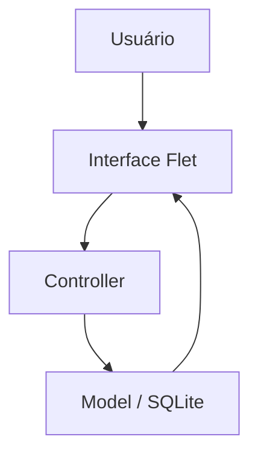

# 🧭 PLANEJAMENTO DO PROJETO

> Documento base de planejamento técnico e estratégico.
> Padrão de trabalho: Python · Ubuntu 25.04 · VS Code 1.104.3 · GitHub + Copilot · Mentoria ChatGPT

---

## 📌 1. Informações Gerais

| Campo                   | Descrição                                     |
| ----------------------- | --------------------------------------------- |
| **Nome do Projeto**     | (Defina um nome claro e descritivo)           |
| **Descrição Resumida**  | (Uma frase explicando o objetivo principal)   |
| **Autor / Responsável** | (Seu nome)                                    |
| **Data de Início**      | (dd/mm/aaaa)                                  |
| **Status Atual**        | Planejamento / Em Desenvolvimento / Concluído |
| **Repositório GitHub**  | (URL do repositório)                          |

---

## 🧩 2. PCR — Problema, Contexto e Requisitos

### 🟥 Problema

Descreva claramente o **problema real** que o projeto busca resolver.

> Exemplo:
> “Usuários têm dificuldade em gerenciar suas listas de tarefas locais sem depender de conexões com a nuvem.”

### 🟨 Contexto

Explique o **ambiente e as motivações** do projeto:

* Quem será beneficiado
* Onde será utilizado
* Restrições técnicas ou de negócio

> Exemplo:
> “Projeto desenvolvido para fins de estudo em arquitetura MVC, interface Flet e banco SQLite, visando aprendizado e práticas de boas práticas de software.”

### 🟩 Requisitos

Liste os **requisitos funcionais** e **não funcionais**:

**Funcionais**

* [ ] O sistema deve permitir criar, listar, editar e excluir tarefas.
* [ ] As tarefas devem ser armazenadas localmente em banco de dados.

**Não Funcionais**

* [ ] Código deve seguir PEP 8.
* [ ] Deve possuir testes unitários.
* [ ] Interface simples, leve e responsiva.

---

## 🧠 3. Objetivos do Projeto

| Tipo                  | Objetivo                                                |
| --------------------- | ------------------------------------------------------- |
| 🎯 **Principal**      | (O que o sistema deve realizar como resultado final)    |
| 🎓 **De Aprendizado** | (O que você pretende aprender e dominar neste projeto)  |
| ⚙️ **Técnico**        | (Metas de arquitetura, padrões e ferramentas a dominar) |

---

## 🧱 4. Arquitetura e Design Pattern

### 🔹 Design Pattern Recomendado

> (Definir com auxílio do ChatGPT Mentor)
> Exemplo: **MVC (Model-View-Controller)** ou **Repository Pattern**

**Motivo da Escolha:**
Explique por que esse padrão é o mais adequado ao projeto.

**Estrutura Simplificada:**

```
src/
 ├── models/
 ├── views/
 ├── controllers/
 ├── services/
 ├── tests/
 └── main.py
```

---

### 🔹 Fluxograma (ou Diagrama Simplificado)

> (Gerar com auxílio do ChatGPT Mentor ou ferramenta externa, ex: draw.io, mermaid)

Exemplo (pseudodiagrama):



---

## ⚙️ 5. Tecnologias e Dependências

| Categoria      | Ferramenta / Biblioteca          | Motivo da Escolha              |
| -------------- | -------------------------------- | ------------------------------ |
| Linguagem      | Python 3.x                       | Principal linguagem do projeto |
| Interface      | Flet / Streamlit / Django / etc. | (Definir conforme o caso)      |
| Banco de Dados | SQLite / PostgreSQL              | (Definir conforme o caso)      |
| ORM            | SQLAlchemy / Django ORM          | Simplificar acesso a dados     |
| Testes         | pytest                           | Estrutura de testes            |
| Linter         | flake8 / black                   | Garantir padrão de código      |
| Documentação   | pdoc / mkdocs                    | Geração de docs automáticas    |

Arquivo `requirements.txt` será gerado após definição das dependências finais.

---

## 🧪 6. Estratégia de Testes

| Tipo de Teste        | Ferramenta            | Descrição                       |
| -------------------- | --------------------- | ------------------------------- |
| Unitário             | pytest                | Testar funções isoladas         |
| Integração           | pytest + fixtures     | Testar interação entre módulos  |
| Interface (opcional) | playwright / selenium | Testes automatizados de UI      |
| Segurança            | bandit / pip-audit    | Verificação de vulnerabilidades |

---

## 🧰 7. Setup do Ambiente

**Criação do ambiente virtual**

```bash
python -m venv .venv
source .venv/bin/activate
pip install -r requirements.txt
```

**Configuração do Git**

```bash
git init
git remote add origin https://github.com/<usuario>/<projeto>.git
```

---

## 🔄 8. Roadmap Inicial (Release 1.0)

| Fase         | Descrição                            | Status |
| ------------ | ------------------------------------ | ------ |
| Planejamento | Definir PCR e arquitetura            | ✅      |
| Setup        | Criar ambiente virtual e repositório | ⬜      |
| Backend      | Criar banco e camadas de modelo      | ⬜      |
| Frontend     | Criar interface inicial              | ⬜      |
| Testes       | Implementar testes básicos           | ⬜      |
| Documentação | Escrever README e docstrings         | ⬜      |

---

## 🧩 9. Integração com Mentor (ChatGPT)

**Função:**

* Auxiliar na definição de arquitetura e design pattern.
* Revisar código e sugerir refatorações.
* Criar testes e validações automáticas.
* Corrigir falhas de segurança ou más práticas.

**Formato de interação sugerido:**

> “Vou iniciar a etapa de criação do módulo X. Segue o contexto atual e o código.
> Me ajude a revisar arquitetura e propor testes adequados.”

---

## 🧠 10. Considerações Finais

* Este documento deve ser mantido **vivo**: atualize a cada mudança estrutural.
* Use-o como **base comparativa** entre o que foi planejado e o que foi realmente implementado.
* O objetivo não é burocratizar, e sim criar **clareza e consistência**.

---

📂 **Sugestão de Estrutura de Diretórios**

```
docs/
 ├── planejamento.md
 ├── FLUXO_DE_TRABALHO.md
 ├── changelog.md
src/
 ├── main.py
 ├── models/
 ├── controllers/
 ├── views/
 ├── services/
 └── tests/
requirements.txt
README.md
.gitignore
LICENSE
```

---
